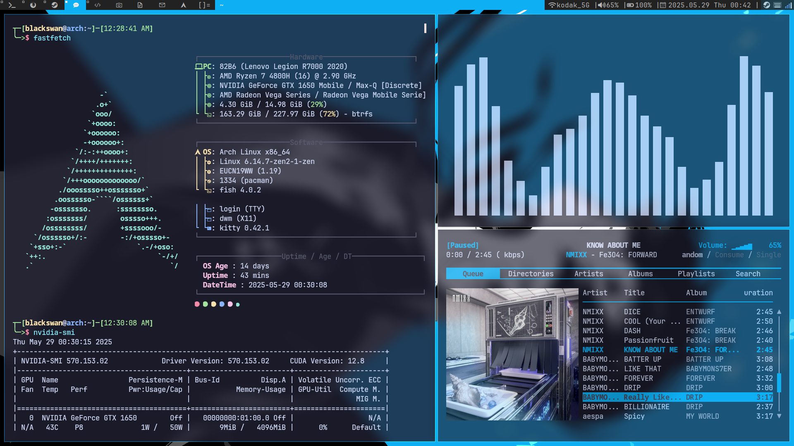

# KenJolno's dwm build

This is my personal setup for my desktop, still working on it. dwm is a fast, small window manager for X.  

  

Feel free to try it, but you might want to change a few lines in the config.h.  

---

## Details
- **OS**: Arch Linux
- **Window Manager**: [dwm](https://dwm.suckless.org/)
- **App Launcher**: [rofi](https://github.com/davatorium/rofi)
- **Wallpaper Loader**: [feh](https://github.com/derf/feh)
- **Animation Compositor**: [picom](https://github.com/yshui/picom)
- **Terminal**: [kitty](https://github.com/kovidgoyal/kitty)
- **File Manager**: [yazi](https://github.com/sxyazi/yazi)
- **Browser**: [zen](https://github.com/hexapode/zenbrowser)
- **Music Player**: [rmpc](https://github.com/mierak/rmpc)
- **Audio Visualizer**: [cava](https://github.com/karlstav/cava)
